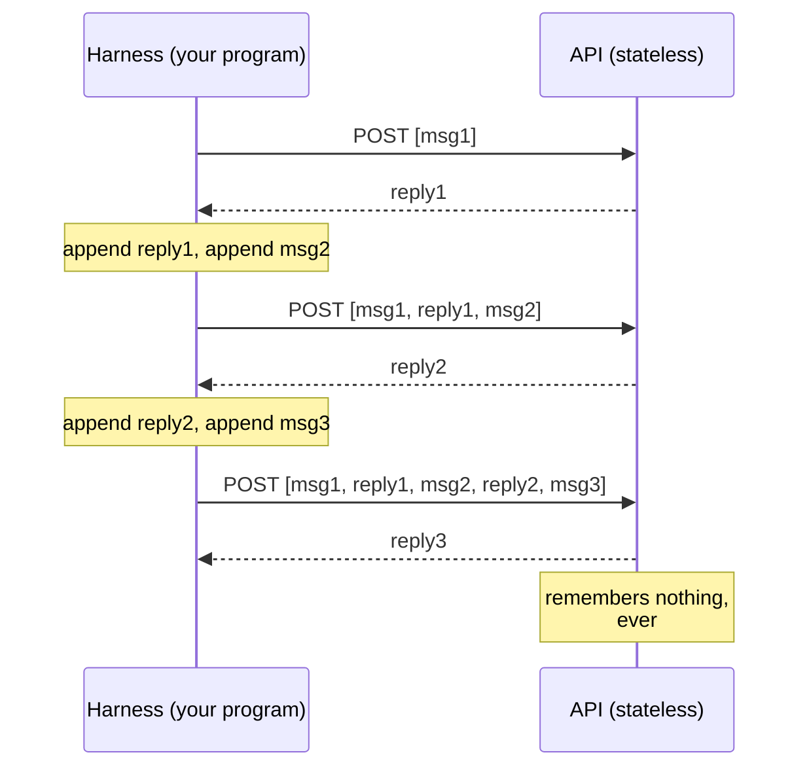

# Chapter 1: It's Just a JSON Array

*Harness Engineering 101, Part I — The Wire. [Series index](index.html) ·
[Next: The Brain](02-the-brain.md)*

---

In 2023 I was building generative AI systems on GPT-3.5. There were no
agents, no tool calls, no caching. There was one thing: you sent an array of
messages to an HTTP endpoint and got formatted text back.

Here is the key fact this series is built on: **that is still all that
happens.** Every agent you have seen, including the one that edits your code
and files your pull requests, is a program that builds a JSON array, POSTs
it, reads the reply, updates the array, and POSTs it again.

The LLM is the brain. The brain can receive text and emit text, and nothing
else. Everything it appears to *do* in the world, some other program did for
it. That program is the **harness**: the body around the brain. The only
channel between brain and body is the JSON array.

Harness engineering is the work of building and maintaining that array. This
chapter is about the array itself.

## The call

Remove every SDK and framework, and a call to a frontier model looks like
this:

```python
import json, os, urllib.request

def call_llm(messages, system=""):
    body = {
        "model": "claude-sonnet-5",
        "max_tokens": 4096,
        "system": system,
        "messages": messages,
    }
    req = urllib.request.Request(
        "https://api.anthropic.com/v1/messages",
        data=json.dumps(body).encode(),
        headers={
            "content-type": "application/json",
            "x-api-key": os.environ["ANTHROPIC_API_KEY"],
            "anthropic-version": "2023-06-01",
        },
    )
    with urllib.request.urlopen(req) as resp:
        return json.loads(resp.read())
```

That is the whole interface. A list of dicts in, a dict out. No sockets, no
sessions, no handshake. One HTTP POST.

The `messages` array is a transcript. Each entry has a `role` and `content`:

```json
[
  {"role": "user", "content": "What does HTTP 418 mean?"},
  {"role": "assistant", "content": "It means the server is a teapot. ..."},
  {"role": "user", "content": "Is it ever used seriously?"}
]
```

You send the array. The model continues it. The response is the next
`assistant` message. That's it.

## The most important sentence in this series

**The API is stateless. The server remembers nothing between calls.**

When you have a "conversation" with a model, there is no conversation stored
on the provider's side. Your program holds the array, appends each new
message, and resends *the entire history* on every turn. The model reads the
whole transcript from scratch every time and predicts what comes next. It
does not remember writing the earlier messages. It sees a transcript where
half the lines are labeled `assistant` and concludes "apparently I said
that."



Once this clicks, a lot of the field gets simpler:

- "Conversation memory" is your program keeping a list.
- "The model forgot something" means the thing fell out of the array.
- "Context management" means deciding what goes in the array.
- "The context window" is the maximum size of the array.
- Cost scales with the array, and you resend it every turn. That becomes
  chapter 5.

One useful consequence: **sessions are just files.** When a coding agent
offers `--resume`, it loads a JSON array from disk and keeps appending. When
you type `/clear`, the implementation is essentially:

```python
messages = []
```

There is no server-side session to reset. Claude Code stores sessions as
JSONL files in a local directory. If you have built a to-do app, you already
know how to build session management for an AI agent.

## Roles: who is speaking

The array has a small set of speakers. The distinction matters because
models are *trained* to treat each role differently (chapter 2 explains what
"trained" means here):

- **`system`** — instructions from the developer to the model: who it is,
  what rules it follows. The model is trained to weight this above user
  text. Anthropic puts it in a top-level `system` field. OpenAI uses a
  message with role `system`, renamed `developer` in its newer Responses
  API. Same concept, three spellings: a privileged channel for the harness
  author.
- **`user`** — the human's turn. Later in the series you will see the
  harness itself use this channel to inject information mid-conversation.
- **`assistant`** — the model's own earlier turns. You wrote none of these,
  but you store and resend all of them. You can even edit them before
  resending, and the model can't tell. That fact becomes a debugging tool in
  chapter 12 and a safety question in chapter 13.
- **Tool results** — the outcome of actions. Chapter 3.

## Content is blocks, not strings

Originally, `content` was a string. It still can be, but in modern APIs it
is a **list of typed blocks**:

```json
{
  "role": "user",
  "content": [
    {"type": "text", "text": "What's wrong with this screenshot?"},
    {"type": "image", "source": {"type": "base64", "media_type": "image/png", "data": "iVBORw0KG..."}}
  ]
}
```

Text is a block. An image is a block (base64 bytes, right in the JSON). A
PDF is a block. A tool call is a block. The model's thinking is a block. The
array did not change shape when models learned to see. The blocks got new
types. Chapter 2 covers what the brain does with an image block; chapter 3
covers tool blocks. The intuition to keep: **whatever modality or feature
ships next year, it arrives as a new block type in the same array.**

## Two dialects, one language

You will meet two wire formats in practice, and the differences are
cosmetic. The same exchange in both:

**Anthropic Messages API:**

```json
POST /v1/messages
{
  "model": "claude-sonnet-5",
  "max_tokens": 1024,
  "system": "You are a terse assistant.",
  "messages": [
    {"role": "user", "content": "Capital of Sri Lanka?"}
  ]
}
```

**OpenAI Chat Completions:**

```json
POST /v1/chat/completions
{
  "model": "gpt-5.2",
  "messages": [
    {"role": "system", "content": "You are a terse assistant."},
    {"role": "user", "content": "Capital of Sri Lanka?"}
  ]
}
```

The differences worth knowing:

| | Anthropic | OpenAI (Chat Completions) |
|---|---|---|
| System prompt | top-level `system` field | first message, role `system` |
| Reply location | `response.content` (list of blocks) | `response.choices[0].message` |
| Tool results | `tool_result` block in a `user` message | separate `tool` role message |
| Turn rules | roles must alternate user/assistant | freeform |

OpenAI's newer **Responses API** reshuffles this again: `input` instead of
`messages`, a `developer` role, and an optional server-side conversation
store. That store is the one real departure from statelessness: the provider
offers to keep the array for you. Gemini has its own spelling. All of them
are the same thing: an ordered list of role-tagged blocks, sent whole,
continued once.

This is why "which provider" is a shallow decision for a harness. The array
is the architecture. The dialect is a serialization detail. One Code, my
rebuild of Claude Code on a provider-neutral runtime, can treat the provider
as a swappable part because everything above the wire format is identical.

## The toy harness, v1

Everything in this chapter fits in a program you can read in a minute. This
is [`harness/v1_chat.py`](https://github.com/IsuruMaduranga/harness-engineering-101/blob/main/src/harness/v1_chat.py), a working chat client with
"memory":

```python
#!/usr/bin/env python3
"""Harness v1: a chat loop. The array IS the conversation."""
import json, os, urllib.request

API_KEY = os.environ["ANTHROPIC_API_KEY"]
MODEL = "claude-sonnet-5"
SYSTEM = "You are a concise assistant."

def call_llm(messages):
    body = {"model": MODEL, "max_tokens": 4096,
            "system": SYSTEM, "messages": messages}
    req = urllib.request.Request(
        "https://api.anthropic.com/v1/messages",
        data=json.dumps(body).encode(),
        headers={"content-type": "application/json",
                 "x-api-key": API_KEY,
                 "anthropic-version": "2023-06-01"})
    with urllib.request.urlopen(req) as resp:
        return json.loads(resp.read())

def main():
    messages = []                                   # the entire "session"
    while True:
        user_text = input("\nyou> ").strip()
        if user_text in ("/quit", ""):
            break
        if user_text == "/clear":
            messages = []                           # "new conversation"
            continue
        messages.append({"role": "user", "content": user_text})
        reply = call_llm(messages)                  # resend EVERYTHING
        text = "".join(b["text"] for b in reply["content"]
                       if b["type"] == "text")
        messages.append({"role": "assistant", "content": reply["content"]})
        print(f"\nassistant> {text}")

if __name__ == "__main__":
    main()
```

About thirty lines, and it already has the shape of every harness you will
ever build: a loop that appends to an array, sends it whole, and appends the
reply. Run it, talk to it, then add `print(len(json.dumps(messages)))` after
each turn and watch the array grow. You are watching your future API bill.

**Homework:** port `call_llm` to OpenAI's Chat Completions format. It is a
ten-minute change. Noticing how little changes is the point.

> **Sidebar: what about streaming?** When a chat UI shows the reply
> appearing word by word, that is the same POST with `"stream": true`. The
> server sends the reply in chunks as it generates them. Streaming is
> *presentation*, not architecture. The array and the statelessness are
> unchanged; the reply just arrives in pieces. This series ignores streaming
> from here on and loses nothing. When you need it for real (the wire
> format, assembling the pieces, connections dying mid-reply, and why long
> requests end up requiring it), Appendix D covers the mechanics.

## What the body does

So a harness is "a program that maintains a JSON array." That sounds like a
clerk's job. Here is the actual job description, as it unfolds over this
series. The harness decides:

- **What enters the array** — user text, file contents, tool results,
  injected instructions (chapters 3, 6, 8).
- **What leaves the array** — compaction, summarization, forgetting
  (chapter 6).
- **What the array's structure must preserve** — ordering and byte
  stability, because cost depends on it (chapter 5).
- **Which of the brain's requests to actually execute** — permissions,
  guardrails, sandboxes (chapter 13).
- **When to interrupt the brain, and when to wake it** (chapters 8 and 9).

This is not passive plumbing. The body decides what the brain gets to see,
when to interrupt it, and which of its commands to refuse. A harness is not
a set of obedient limbs. It is a body with reflexes.

That framing also explains why this series is not only about coding agents.
A coding harness gives the brain hands that edit files and run shells. A
robotics harness gives it motors. A support-desk harness gives it a ticket
queue. The bodies differ. The nervous system, the JSON array and the loop
around it, is the same everywhere. This series builds a coding body because
it is the easiest to demo in text, but every pattern transfers.

## What you now know

- Talking to an LLM is one stateless HTTP POST: role-tagged messages in, one
  continuation out.
- All memory, sessions, and "context" live in your program's array. `/clear`
  is `messages = []`. Resume is a file read.
- Content is typed blocks (text, images, documents, and later tool calls and
  thinking), not strings.
- Provider APIs are dialects of the same structure. A harness above the wire
  format is portable.
- The harness is the body. It builds the array. Everything else in this
  series is one of its organs.

Next question, before we add a single feature: what exactly is on the other
end of that POST, and why does knowing how it was trained predict most of
its strange behavior?

*[Next: Chapter 2 — The Brain: A Next-Token Black Box](02-the-brain.md)*
