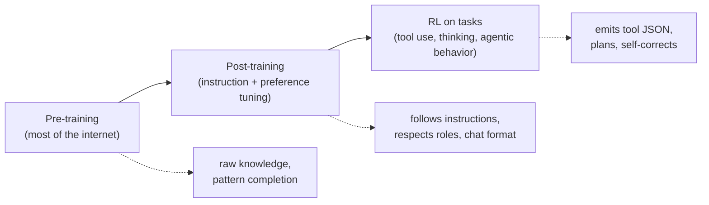

# Chapter 2: The Brain: A Next-Token Black Box

*Harness Engineering 101, Part I — The Wire.
[Series index](README.md) · [Prev](01-its-just-a-json-array.md) ·
[Next: Tools](03-tools.md)*

---

Chapter 1 showed the wire: a JSON array in, a continuation out. This chapter
is about the thing on the other end.

Here's the whole model, and it is not much: **an LLM does one thing. You
give it a sequence of tokens, and it gives back a probability for every
possible next token. The serving layer then picks one, adds it to the
sequence, and runs the model again.** That's it. No goals, no memory,
nothing saved between calls.

(By "serving layer" I mean the code that runs the model for you: the
provider's inference stack. The model itself only outputs the
probabilities; choosing a token from them is a separate step done by that
code, which is why you can change how random it is per request. More on
that below.)

The rest of this chapter explains one idea: three stages of training were
added on top of that single operation, and that training history predicts
almost every behavior that will surprise you later. Why the model
hallucinates. Why it follows the system prompt. Why tool calls come out as
valid JSON. Why "thinking" works.

You do not need to know how to build a model to build a harness, the same
way you do not need to be a brain surgeon to be a physical therapist. But
you do need this much. This chapter has no code. It is the shortest mental
model of an LLM that is still useful for harness work.

## One operation, repeated

An LLM does exactly one thing: given a sequence of tokens, it outputs a
probability for every possible next token. The serving layer picks one
(weighted by those probabilities), appends it to the sequence, and runs the
model again. And again. That loop, run until a stop condition, is text
generation. The model produces the probabilities; the code around it does
the picking and the looping.

A few terms, quickly:

- **Token**: a chunk of text, usually 3 to 4 characters of English. "harness
  engineering" is about 4 tokens. Everything is measured in tokens: context
  windows, prices, speed.
- **Temperature**: how randomly the serving layer picks from the
  probabilities. Temperature 0 means always pick the most likely token.
  Higher values mean more variety. For agents you usually want low
  temperature; you want the probable action, not the creative one. (This is
  the proof that the picking happens outside the model: temperature is a
  setting you send with each request, so the same model can pick
  differently from the same probabilities.)
- **Context window**: the maximum number of tokens the model can take as
  input. This is the hard size limit on your array from chapter 1.

The model has no memory, no goals, no state between calls. It is a pure
function from "sequence so far" to "what probably comes next." Everything
that looks like memory, personality, or intent comes from what is in the
sequence, and the sequence is your array.

## Three layers of training

Why does predicting the next token produce something that can debug your
code? Because of what the model was trained on, in three stages. Each stage
matters to you as a harness engineer for a different reason.

### Pre-training: compression of the internet

The model first learns by predicting the next token across a huge slice of
human text: code, books, documentation, forums. Nothing else. No goals, no
rules, no chat. The result is a raw pattern-completion engine that has
compressed an enormous amount of knowledge into its weights.

What this stage explains for you:

- **Why the model knows things.** Facts, APIs, idioms: they were in the
  training text.
- **Why it hallucinates.** The model learned to produce text that *sounds
  likely*, not text that is true. When the real answer was not in its
  training data, or it cannot recall it, the most likely next words are
  still a smooth, confident sentence. Hallucination is not a bug or a lie.
  It is the training goal working exactly as designed on a question the
  model cannot answer. You cannot remove this with a clever prompt. You can
  only design around it, which is why harnesses feed the model facts (file
  contents, tool results) instead of trusting its memory.
- **Why the knowledge cutoff exists.** The training text was collected up to
  some date. Everything after that date must come in through the array.

### Post-training: from engine to assistant

A raw pre-trained model does not answer questions. If you type "What is the
capital of France?" it might continue with "What is the capital of Germany?"
because lists of questions were common in its training data. Post-training
fixes this. The model gets more training on hand-picked conversations, and
it is adjusted using human (and AI) judgments about which answers are
better, until it reliably acts like an assistant: it answers the question,
follows instructions, and refuses some things.

What this stage explains for you:

- **Why roles work.** The model is trained on transcripts where `system`
  text sets the rules and the assistant follows them. The system prompt has
  authority because the model was trained to give it authority, not because
  the API enforces anything. This matters: role authority is a learned
  behavior, strong but not absolute.
- **Why the chat format exists at all.** The message array from chapter 1
  mirrors the format of post-training data. You are not sending a
  conversation to the model. You are sending text shaped like the
  conversations it was trained to continue.

### RL on tasks: where agents come from

The newest stage. The model practices multi-step tasks (coding, browsing,
math) and is rewarded for outcomes: the test passed, the answer was right.
This is reinforcement learning, and it is where "agentic" behavior comes
from. Three learned skills matter most for this series:

- **Tool use.** Models emit tool calls as clean, schema-matching JSON
  because they were explicitly trained on millions of examples of doing so.
  The API does not enforce your schema with a parser. The model *learned*
  the format. This is why chapter 3 will look surprisingly easy.
- **Thinking.** Modern models can emit reasoning before their answer,
  wrapped in special blocks (Anthropic calls it extended thinking; you may
  see `<thinking>` tags in older setups). There is no separate reasoning
  engine. Thinking is ordinary next-token generation into a scratch area,
  and models were RL-trained to use that scratch area because reasoning
  first measurably improves the final answer. The "effort" or "reasoning
  budget" knob in modern APIs is also trained behavior: the model learned to
  spend more or fewer thinking tokens when told to. For the harness,
  thinking is just another block type in the array, one that costs tokens
  and usually must not be resent in later turns (providers have rules for
  this).
- **Self-correction.** RL-trained models treat an error message as a signal
  to try a different approach, because retrying blindly did not earn reward
  during training. Chapter 4 leans on this: feeding failures back into the
  array is half of what makes agents work.

The practical summary of all three stages: **when the model behaves well, it
is because someone trained it to; when it behaves badly, no message in your
array fully overrides that.** A harness works *with* the trained behaviors.
It cannot install new ones.

## More than text: modalities

Modern models accept images and documents. It is natural to assume there is
a separate vision system involved. There is not, in any sense that matters
to you.

When you send an image block, the image is cut into small patches, and each
patch is encoded into tokens by a vision encoder that was trained alongside
the language model. Those image tokens go into the same sequence as your
text tokens, and the same next-token machinery runs over all of it. The
model "sees" the way it "reads": everything becomes tokens in one sequence.
This is why a large image costs context window space, and why a model can
answer questions that mix text and image so naturally. There is one brain,
one sequence.

PDFs make this even clearer. When a model "reads a PDF," here is what
usually happens: the *harness or the provider's API layer* pulls out the
text and turns each page into an image, then puts both into the array as
ordinary text and image blocks. The brain never sees a PDF. It sees tokens
that used to be a PDF.

Note what just happened: a thing marketed as a model capability turned out
to be mostly body work. Preprocessing, extraction, and rendering happen in
the harness or in the provider's serving stack, before the brain runs. The
same is true of audio in many products (a transcription model runs first)
and of "reading spreadsheets" (the harness converts to CSV or renders a
screenshot). When you evaluate any impressive capability, ask: how much of
this is the brain, and how much is the body? The answer is usually "more
body than you think," and that is good news, because you can build the body.

## Working rules for harness engineers

Everything above compresses into rules you will use in every later chapter:

1. **The model is a pure function.** Same array in, same distribution out.
   All state is your problem, and your opportunity.
2. **Trust recall less than retrieval.** Weights hallucinate; tool results
   do not. Feed the brain ground truth.
3. **Roles work because of training, not enforcement.** The system prompt is
   strong guidance, not an access-control system. Chapter 13 treats it
   accordingly.
4. **Tool calling and thinking are trained skills.** You get them by asking
   in the format the model was trained on, which the provider documents.
5. **Everything is tokens in one sequence.** Images, thinking, tool calls:
   all blocks, all counted, all paid for.
6. **Errors are useful input.** The model was trained to react to failure.
   Give it the failure.

## What you now know

The brain is a next-token predictor with three layers of training: raw
knowledge from pre-training, assistant behavior from post-training, and
agentic skills (tools, thinking, self-correction) from RL. It hallucinates
by design, follows roles by training, and sees images as tokens. It cannot
act, remember, or perceive anything you do not put in the array.

Which raises the obvious next question: if the brain can only emit text, how
does an agent ever *do* anything? The answer is a formatting trick so simple
it feels like it should not work.

*[Next: Chapter 3 — Tools: JSON Mapped to Functions](03-tools.md)*
