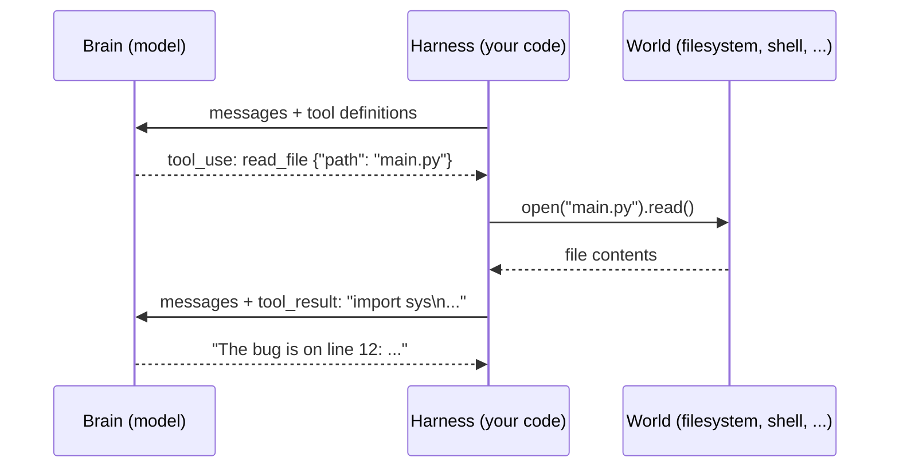

# Chapter 3: Tools: JSON Mapped to Functions

*Harness Engineering 101, Part I — The Wire.
[Series index](README.md) · [Prev](02-the-brain.md) ·
[Next: The Agent Loop](04-the-agent-loop.md)*

---

**The failure:** the brain can only emit text. Ask it to "check whether the
tests pass" and the best it can do is guess. It cannot run anything, read
anything, or touch anything.

**The patch:** let the model emit a structured request, and have your
program execute it. That is the entire idea behind tools, and it is the
single most load-bearing trick in modern AI. This chapter shows that it is
just JSON on both ends.

## The contract

Tool use is a three-step contract between brain and body:

1. You tell the model what functions exist (names, descriptions, parameter
   schemas). This goes in the request, next to your messages.
2. The model, instead of answering in prose, may reply with a **tool call**:
   a block that names a function and provides arguments as JSON.
3. Your program runs the real function, puts the output back into the array
   as a **tool result**, and calls the API again so the model can continue.



Hold on to the key point: **the model never executes anything. It asks.**
The tool call is a polite, machine-readable request. Your harness decides
whether to honor it, runs the code, and reports back. Every capability an
agent has is a function you wrote and chose to expose. This is also why
safety lives in the harness (chapter 13): the body owns the hands.

## What it looks like on the wire

You define tools with a name, a description, and a JSON Schema for the
arguments:

```json
{
  "name": "read_file",
  "description": "Read a file from the local filesystem and return its contents.",
  "input_schema": {
    "type": "object",
    "properties": {
      "path": {"type": "string", "description": "Path to the file"}
    },
    "required": ["path"]
  }
}
```

The description is not decoration. It is the only documentation the model
gets, and writing good tool descriptions is real prompt engineering. Vague
description, wrong usage.

When the model wants the tool, its reply contains a `tool_use` block instead
of (or alongside) text:

```json
{
  "role": "assistant",
  "content": [
    {"type": "text", "text": "Let me look at the file first."},
    {"type": "tool_use", "id": "toolu_01A", "name": "read_file",
     "input": {"path": "main.py"}}
  ]
}
```

You run the function, then append the result as the next `user` message:

```json
{
  "role": "user",
  "content": [
    {"type": "tool_result", "tool_use_id": "toolu_01A",
     "content": "import sys\n\ndef main():\n    ..."}
  ]
}
```

Then you POST the whole array again. Notice two things. First, the tool
result travels in a `user` message; from the model's point of view, the
world answers on the user's channel. Second, this is chapter 1's loop with
one new block type. Nothing about the wire changed.

Why does the model produce clean, schema-matching JSON? Chapter 2's answer:
it was RL-trained on millions of tool-call examples. You are not parsing
free text and hoping. Modern providers even guarantee the arguments parse as
JSON. (In the GPT-3.5 days, we begged the model in the prompt to "respond
ONLY with JSON" and wrote regex fallbacks for when it apologized first.
Function calling moved that trick into training, and that is the entire
difference.)

## The toy harness, v2

[`harness/v2_tools.py`](harness/v2_tools.py) adds two tools to v1. The new
parts are marked:

```python
TOOLS = [                                            # NEW: the menu
    {"name": "read_file",
     "description": "Read a text file and return its contents.",
     "input_schema": {"type": "object",
                      "properties": {"path": {"type": "string"}},
                      "required": ["path"]}},
    {"name": "run_command",
     "description": "Run a shell command and return stdout+stderr.",
     "input_schema": {"type": "object",
                      "properties": {"command": {"type": "string"}},
                      "required": ["command"]}},
]

def execute_tool(name, args):                        # NEW: the dispatch
    """Map the model's JSON request to a real function call."""
    try:
        if name == "read_file":
            return open(args["path"]).read()
        if name == "run_command":
            out = subprocess.run(args["command"], shell=True,
                                 capture_output=True, text=True, timeout=60)
            return out.stdout + out.stderr
        return f"ERROR: unknown tool {name}"
    except Exception as e:
        return f"ERROR: {e}"                         # errors go BACK to the model
```

And `call_llm` now sends `"tools": TOOLS` in the body. That is the whole
patch: a menu, and a dispatch table from names to functions. "Tool" sounds
like infrastructure. It is a dict lookup.

One detail that matters more than it looks: `execute_tool` never raises. A
failed tool call becomes an error *string*, sent back to the model as the
tool result. Chapter 2 said models are trained to react to failure; chapter
4 builds the loop that lets them. Swallowing a tool error, or crashing on
it, throws away the model's best recovery signal.

v2 handles exactly one tool call per turn, then returns to the prompt. Try
it: ask "what files are in this directory?" and watch the model call
`run_command` with `ls`. Then ask something that needs two steps, like
"read the largest file here," and watch it fail: it needs the result of
`ls` before it can call `read_file`, but our program hands control back to
you after one call. That failure is chapter 4.

## The user is a tool too

Here is a new way to look at tools that helps for the rest of the series.
Once you see tools as "the model requests, the world responds," you notice
the human sitting inside the world.

Production agents expose a tool that looks like this:

```json
{
  "name": "ask_user_question",
  "description": "Ask the user a clarifying question when you are blocked on a decision only they can make.",
  "input_schema": {
    "type": "object",
    "properties": {
      "question": {"type": "string"},
      "options": {"type": "array", "items": {"type": "string"}}
    },
    "required": ["question"]
  }
}
```

The implementation renders the question, waits for input, and returns the
answer as an ordinary tool result. That is **human-in-the-loop** in its
purest form: the person is one more thing the body can consult, on the same
wire format as the filesystem. Claude Code's multiple-choice question
dialogs are exactly this tool. No special mechanism, no separate channel.
The model learned when to ask a person the same way it learned when to read
a file.

There is a second, more important place humans enter the loop: approval.
"The model asked to run `rm -rf`; should the body obey?" That is a harness
decision, not a tool, and it gets its own chapter (13).

> **Sidebar: structured output.** Sometimes you do not want actions; you
> want the model's *answer* as machine-readable data, like
> `{"sentiment": "negative", "score": 0.87}`. Providers offer JSON modes
> for this, but the oldest reliable trick is to define one tool named
> `report_answer` whose input schema is your desired output format, and
> force the model to call it. The tool executes nothing; its arguments
> *are* the output. Structured output and tool calling are the same trained
> skill pointed at different goals: one asks for action, the other for
> shape.

> **Sidebar: server-side tools.** Some tools run without any harness code.
> Ask Anthropic's API for `web_search` and the *provider's* infrastructure
> executes the search during the request, splices the results into the
> conversation, and bills you for the tokens. The array you get back shows
> the tool round already resolved. Same contract, but the provider's body
> did the work: limbs you did not build. The trade is control. You cannot
> gate, log, or modify a server-side tool call. Your permission system
> (chapter 13) never sees it. Convenient for search; think twice before
> accepting it for anything that touches your systems.

## What you now know

- A tool is three pieces of JSON: a schema in the request, a `tool_use`
  block in the reply, a `tool_result` block in the next message.
- The model asks; the harness acts. Every agent capability is a function
  you chose to expose, which is why capability and safety are both harness
  properties.
- Tool errors are input, not exceptions. Send them back.
- The human is a tool (clarifying questions) and a gate (approvals).
- Structured output is tool calling pointed at data. Server-side tools are
  tool calling executed by the provider.

v2 can act, once. The obvious next failure: real tasks need the model to
act, look at the result, and act again, without a human pressing enter
between steps. That loop has a grand name. It is four lines of code.

*[Next: Chapter 4 — The Agent Loop](04-the-agent-loop.md)*
