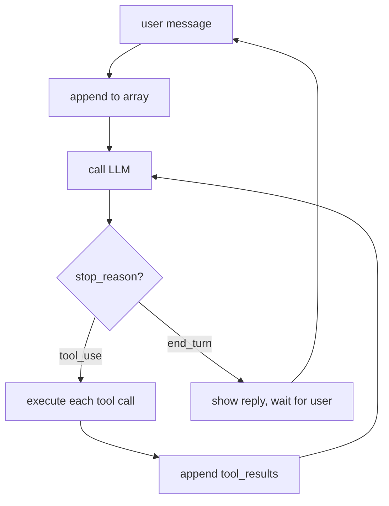

# Chapter 4: The Agent Loop

*Harness Engineering 101, Part I — The Wire.
[Series index](README.md) · [Prev](03-tools.md) ·
[Next: Caching](05-caching.md)*

---

**The failure:** v2 of our harness executes one tool call, lets the model
react, and hands control back to the human. Ask it to "find the bug in this
project and fix it" and it stalls after the first step, because step two
needs the result of step one, and nobody is there to keep the conversation
going.

**The patch:** keep the conversation going. Automatically. In a loop.

That is the entire chapter. I want to be honest about that up front, because
this is the point where the industry's vocabulary gets grand: "agentic AI,"
"autonomous systems," "orchestration." Here is what the words mean in code:

```python
while True:
    reply = call_llm(messages)
    messages.append(assistant_message(reply))
    if reply["stop_reason"] != "tool_use":       # model is done talking
        break
    results = [execute_tool(b) for b in tool_calls(reply)]
    messages.append(tool_results_message(results))
```

Call the model. If it asked for tools, run them, append the results, and
call the model again. Repeat until it stops asking. **An agent is a while
loop around a chat completion.** Everything else in this series is a patch
to this loop.

## Why such a small loop does so much

The loop looks too simple to produce the behavior you have seen from coding
agents: exploring a codebase, forming a plan, hitting an error, changing
approach, finishing the job. But recall chapter 2: the model was RL-trained
on exactly this pattern. Multi-step work, observe result, decide next step.
The intelligence is in the brain. The loop's job is to *not get in the way*:
keep feeding results back and let the trained behavior express itself.

This is worth internalizing because it predicts where effort pays off. When
an agent performs badly, beginners add orchestration: hardcoded step
sequences, planner modules, state machines around the model. Usually the
better fix is in the array: clearer tool descriptions, better error
messages, the right context. The loop rarely needs to be smarter. The
messages need to be better. (Chapter 10 returns to this when we look at
frameworks.)

## Stop reasons: how the loop knows when to stop

Each API response carries a `stop_reason` telling you why the model stopped
generating. The loop is really a dispatch on this field:

| stop_reason | Meaning | Loop's job |
|---|---|---|
| `tool_use` | "I want tools run" | execute, append results, continue |
| `end_turn` | "I'm done" | exit loop, show the user the text |
| `max_tokens` | reply hit the length cap | continuation is truncated; handle it (retry higher, or continue) |
| `refusal` / safety | model declined | exit, surface the message |

The two-state core is: **`tool_use` means the turn is still in progress;
`end_turn` means the brain considers the task done.** A "turn" in an agent
is not one API call. It is one user request plus however many model+tool
rounds the loop runs before `end_turn`. A single "fix the tests" turn might
be 40 API calls. The user sees one answer; the array saw 40 round trips.
(Remember chapter 1: each of those 40 calls resent the whole array. Hold
that thought for chapter 5.)



## Errors are fuel

The most counterintuitive habit in agent building: **when a tool fails, you
are not handling an error. You are delivering information.**

In normal software, an exception is a problem for the *programmer*. In an
agent, a failed command is a problem for the *model*, and the model is good
at it. Send back the compiler error, the stack trace, the "file not found,"
exactly as the tool produced it, and the model reads it and adjusts: fixes
the typo in the path, installs the missing package, takes another approach.
Agents debug themselves, but only if the loop delivers the failure.

The failure modes to avoid, in increasing order of how often I see them:

- **Crashing the loop on a tool error.** The model never learns what
  happened; the turn dies.
- **Swallowing the error** and returning something vague like "command
  failed." You just replaced the model's best signal with noise.
- **Fixing it silently in the harness** (retrying with a "corrected"
  argument you guessed). Now the model's picture of the world is wrong,
  and its next step builds on a state it does not know about.

The rule I follow: a tool result is either the real output or the real
error, marked as an error, with enough detail that a person could act on it.
The model gets the same courtesy.

One necessary limit: the loop needs a maximum round count (say, 50). A model
stuck alternating between two failing approaches will happily burn your API
budget forever. When you hit the cap, stop and tell the user. That is not
the model's failure signal; it is yours.

## ReAct: the loop's ancestor

You will run into the name **ReAct** (from a 2022 paper, "Reasoning +
Acting"), so let me place it for you.

Before models were trained for tool use, we got agent behavior by prompt
formatting. You instructed the model to answer in a rigid pattern:

```
Thought: I should check what files exist here.
Action: run_command["ls"]
Observation: main.py  test_main.py
Thought: Now I should read main.py.
Action: ...
```

The harness parsed the `Action:` line with string matching, executed it,
appended a fake `Observation:` line, and called the model again. Same loop
as ours, but with the tool protocol built from prose and hope. It broke
whenever the model varied the wording, which was often.

ReAct matters for two reasons. First, historically: its "reason, act,
observe" cycle is what got baked into models during the RL training chapter
2 described. Native tool calling *is* ReAct, moved from the prompt into the
weights. The pattern won; the string parsing died. Second, practically:
when you see a framework or tutorial teaching ReAct-style prompting today,
you are looking at a technique for models that lack tool training, or at a
tutorial older than it looks. With a modern model you get the Thought (as
thinking blocks), the Action (as tool_use blocks), and the loop, natively.

## The toy harness, v3

[`harness/v3_agent.py`](harness/v3_agent.py) turns v2 into a real agent.
The heart of the change:

```python
def run_turn(messages):
    """One user turn = as many model/tool rounds as the task needs."""
    for _ in range(MAX_ROUNDS):                      # NEW: the agent loop
        reply = call_llm(messages)
        messages.append({"role": "assistant", "content": reply["content"]})
        for block in reply["content"]:
            if block["type"] == "text" and block["text"].strip():
                print(f"\nassistant> {block['text']}")

        if reply["stop_reason"] != "tool_use":       # done: hand back to user
            return

        results = []                                 # run EVERY requested tool
        for block in reply["content"]:
            if block["type"] == "tool_use":
                print(f"[tool] {block['name']}({json.dumps(block['input'])})")
                results.append({
                    "type": "tool_result",
                    "tool_use_id": block["id"],
                    "content": execute_tool(block["name"], block["input"]),
                })
        messages.append({"role": "user", "content": results})
    print("\n[harness] hit MAX_ROUNDS, stopping this turn")
```

Plus one new tool, `write_file`, so the agent can change the world, not just
observe it. Three tools, one loop, about 90 lines total, and this program
can genuinely do things: try `"clone this repo, find out why the tests fail,
and fix it"` on something small. Watching your own 90 lines do that is the
moment this field stops being mysterious.

Run it and watch the shape of the transcript scroll by: tool call, result,
tool call, result, text. That shape *is* the agent. Everything after this
chapter is about keeping that loop healthy when it runs long, gets
expensive, or does something dumb.

> **A note on parallel tool calls.** Models often request several tools in
> one reply (read three files at once). That is why the code collects every
> `tool_use` block before calling the API again: all results for one
> assistant message must come back in one user message, matched by ID. Run
> them concurrently if you like; deliver them together.

## What you now know

- An agent is a while loop: call the model, execute requested tools, append
  results, repeat until `end_turn`.
- `stop_reason` is the loop's control signal. One user turn may be dozens of
  API calls.
- Tool failures are input for the model, not exceptions for you. Deliver
  them raw; cap the rounds.
- ReAct is this loop implemented in prompt text, from before tool use was
  trained into the models. The pattern survived; the prompting did not.

The loop works. Now look at what it costs. Forty rounds, each resending the
entire growing array. If the array is 50,000 tokens by mid-task, that is
two million input tokens for one user request, unless we do something. The
something is caching, and it is why the *order* of your array is about to
become a financial decision.

*[Next: Chapter 5 — Caching: Why Order Is Load-Bearing](05-caching.md)*
