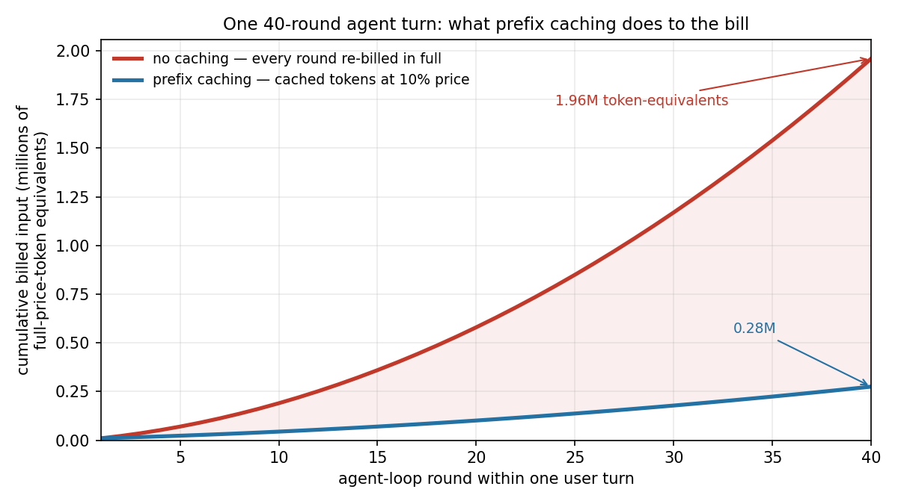
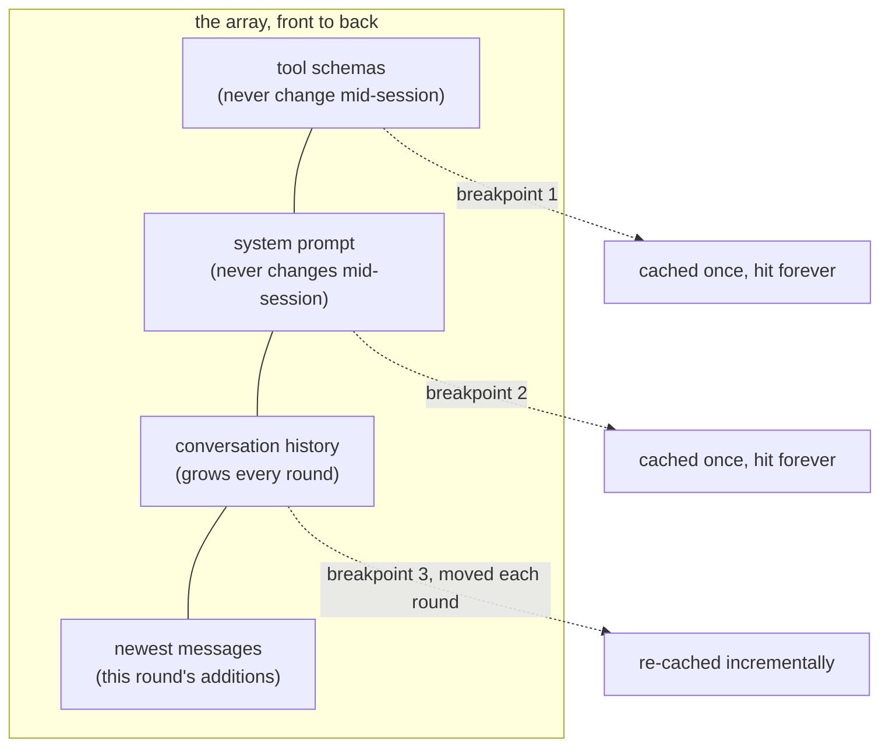

# Chapter 5: Caching: Why Order Is Load-Bearing

*Harness Engineering 101, Part I — The Wire.
[Series index](index.html) · [Prev](04-the-agent-loop.md) ·
[Next: Context Is a Budget](06-context-is-a-budget.md)*

---

**The failure:** the agent loop works, and it quietly burns money. Every
round resends the entire array, and the array grows every round. Let me put
numbers on it. Suppose a coding task runs 40 rounds and each round adds
about 2,000 tokens (a tool call plus its result). The array starts at
10,000 tokens (system prompt, tool schemas, the user's request, some file
context). Round 1 sends 10,000 input tokens. Round 2 sends 12,000. Round 40
sends 88,000. Total input tokens across the turn:

> 10,000 + 12,000 + 14,000 + ... + 88,000 = **1.96 million tokens**, for one
> user request.

The work grows with the *square* of the conversation length, because you pay
for the whole history on every step. In the GPT-3.5 days this didn't hurt:
conversations were short and nothing looped. The agent loop made it hurt.

**The patch:** the provider caches the part of your array it has already
processed, and charges you a tenth of the price for it. But the cache only
works if your harness keeps the array **byte-stable**. This chapter is about
what that means and how it changes the way you build.

## How prefix caching works

When a model reads your array, it processes tokens front to back, building
up internal state as it goes. That state is expensive to compute. **Prompt
caching** means the provider stores it, keyed on the exact bytes processed
so far. On your next request, it compares your new array against the stored
one, front to back, finds the longest matching **prefix**, and skips
recomputing it. Only the new tail gets processed at full price.

Cached tokens cost roughly 10% of normal input price on Anthropic (cached
input is similarly discounted on OpenAI, which caches automatically). So the
economics of the agent loop become:

- **Round 1:** process 10,000 tokens, full price. Cache them.
- **Round 2:** the first 10,000 tokens match the cache. Pay 10% for those,
  full price only for the new 2,000.
- **Round 40:** pay 10% on 86,000 cached tokens, full price on 2,000 new.

Same conversation, same model, same replies. About an 80 to 90 percent cost
cut, plus a large latency cut, because the provider skips the reading work,
not just the billing.



*Generated by [`diagrams/gen_cache_economics.py`](https://github.com/IsuruMaduranga/harness-engineering-101/blob/main/src/diagrams/gen_cache_economics.py).*

Notice what made this possible: **the agent loop is append-only.** Each
round adds messages at the end and touches nothing earlier. An append-only
array has a perfectly stable prefix, which is a perfectly cacheable prefix.
The loop we built in chapter 4 was accidentally cache-shaped. Keeping it
that way is now your job.

## The one rule: never edit the top

The cache matches bytes from the front. The moment byte 1,000 differs from
the cached version, everything after byte 1,000 is recomputed at full
price, even if the remaining 80,000 tokens are identical. So the rule is:

> **Appending is cheap. Editing anything above the append point costs you
> everything below it.**

This sounds easy to follow, and it is genuinely easy to break. The classic
accidental cache-busters, all of which I have shipped or reviewed:

- **A timestamp in the system prompt.** `Current time: 14:32:07` at the top
  of the array means *no request ever hits the cache*. If the model needs
  the date, put it somewhere stable (the date, not the second), or inject it
  low in the array.
- **Reordering tools.** Tool schemas are part of the prefix. Building the
  tool list from an unordered dict, so it serializes in a different order
  per process? Cache gone. Sort your tools.
- **"Improving" the system prompt mid-session.** Any conditional text up
  top ("the user seems frustrated, add a tone note") rewrites byte one.
- **Rotating content in place**, like keeping a live "current status"
  section near the top of the array and updating it each round.
- **Removing old messages from the middle** to save space. This is the
  painful one: trimming the array to make it *smaller* can make it *more
  expensive*, because the trim invalidates the prefix. Context reduction has
  to be done in deliberate, occasional jumps (chapter 6), not in small
  continuous trims.

The design consequence runs deeper than avoiding bugs: **information wants
to enter the array at the bottom.** When the harness must tell the model
something mid-session (a file changed on disk, the current todo list),
append it as a new message near the end. Don't update some canonical block
near the top. Chapter 8 builds a
whole steering mechanism on this principle, and it exists *because* of this
chapter.

Production harnesses treat prefix stability as an invariant with tests. In
One Code, the system prompt stays byte-stable across turns unless something
genuinely changed. Payload-capture tests (chapter 12) check this, because
one careless byte up top is an invisible 10x price increase. Nothing breaks.
No error appears. You just quietly pay full price on every request, and only
notice if you are measuring cache-hit rate.
Measure cache-hit rate. The API tells you: responses report
`cache_read_input_tokens`, and that number should be most of your input on
every round after the first.

## Cache breakpoints (Anthropic) vs automatic (OpenAI)

OpenAI caches automatically: send a request whose prefix matches a recent
one and the discount appears. Nothing to configure, nothing to control.

Anthropic makes it explicit. You mark up to four **cache breakpoints** in
the array with `cache_control` markers:

```json
{"type": "text", "text": "...end of system prompt...",
 "cache_control": {"type": "ephemeral"}}
```

A breakpoint says "cache everything up to and including this block." The
natural layout for an agent has breakpoints at the stable frontiers:



The moving third breakpoint is the trick worth remembering: each round you
place it on the newest message. The provider then caches through that point,
so next round's prefix match covers everything you have sent so far.
Explicit control costs a little code (a 25% write surcharge on newly cached
tokens, on Anthropic) and buys predictability: you know exactly what is
cached and can design the array around it.

Either way, the discipline is identical. The provider only rewards a
harness that keeps its prefix stable. Caching is not a feature you turn on.
It is a property your architecture either has or lacks.

## Cache lifetime, briefly

Caches expire. Anthropic's default entries live about 5 minutes (refreshed
on every hit; a paid 1-hour option exists), OpenAI's several minutes to an
hour depending on load. For an active agent loop this does not matter: rounds
are seconds apart, so the cache stays hot. The place it hurts is the *human*
pause. A user who reads your agent's answer for ten minutes and then replies
pays a full-price re-read of the whole array. Nothing in the harness
fixes economics you don't control. Just know this: the first request after
a long pause is the expensive one. "Why was this turn 10x the price of the
last one?" usually has a boring answer.

## What this changes about your thinking

Chapter 1 said the harness "builds and maintains the array." This chapter
adds the constraint that makes that job interesting: **the array is not just
content, it is a physical layout with a price gradient.** Top of the array:
frozen, cheap, touch it and pay. Bottom of the array: fluid, where all new
information lands. Every later chapter respects this gradient:

- Context management (chapter 6) trims in rare, deliberate jumps because
  every trim is a cache reset.
- Steering (chapter 8) injects at the bottom, never edits the top.
- Memory and instructions ride in the *first user message* in Claude Code
  rather than the system prompt partly so the system prompt can stay
  identical across sessions and features.
- Debugging (chapter 12) watches `cache_read_input_tokens` as a vital sign.

## What you now know

- The agent loop resends a growing array; cost grows with the square of
  conversation length. Caching is what makes agents economically possible.
- Prefix caching matches your array byte-for-byte from the front and
  discounts the matched part about 90%.
- Append-only conversations are natively cacheable. Editing anything above
  the append point silently forfeits the discount for everything below it.
- Anthropic uses explicit breakpoints; OpenAI is automatic; the discipline
  (byte-stable prefix, information enters at the bottom) is the same.
- Watch `cache_read_input_tokens`. A quiet cache is an expensive bug.

Part I is complete: the wire, the brain, tools, the loop, and the economics.
Part II is about what happens when the loop runs *long*: the array
approaches the context window, and everything from here on is about
spending that space well.

*[Next: Chapter 6 — Context Is a Budget, Not a Bag](06-context-is-a-budget.md)*
