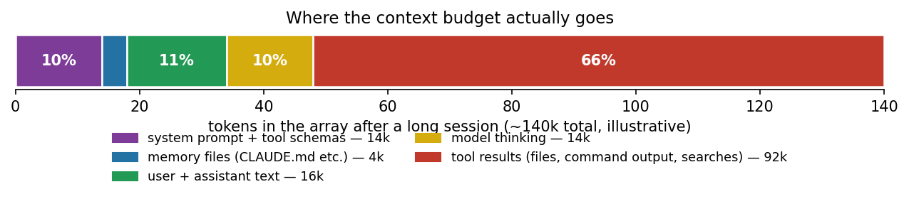
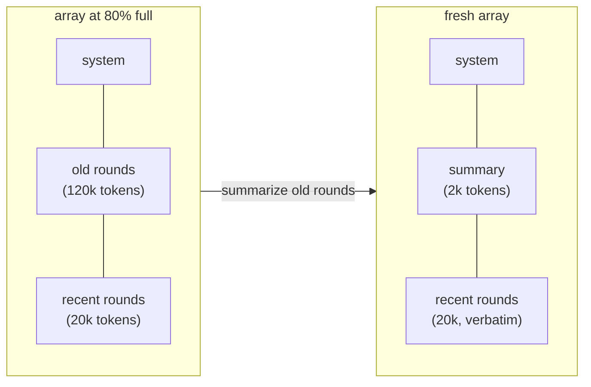

# Chapter 6: Context Is a Budget, Not a Bag

*Harness Engineering 101, Part II — Running Long.
[Series index](index.html) · [Prev](05-caching.md) ·
[Next: Subagents](07-subagents.md)*

---

**The failure:** the loop from chapter 4, left alone on a big task, fills
its context window. A long debugging session reads dozens of files, runs
dozens of commands, and every byte of that lands in the array and stays
there. At some point the array hits the model's input limit and the next
API call is rejected. Task dies mid-flight.

But the hard limit is only the visible half of the failure. The invisible
half arrives earlier: **models get worse before they get full.** Long before
the window limit, an overfull array weakens the model's attention. Details
from the middle of a 150,000-token conversation get missed or half-recalled.
Instructions given early stop being followed. People call this **context
rot**, and it means the practical budget is smaller than the advertised
window. A 200,000-token window is not 200,000 tokens of dependable
attention.

**The patch** is a change of mindset, not one mechanism: stop treating the
array as a bag you throw things into, and start treating it as a budget you
spend. Part II of this series is that mindset, developed over four chapters.
This one covers the accounting and the two basic moves: forgetting well
(compaction) and remembering outside the array (memory files).

## Know what you are spending on

First, measure. Every API response reports input token counts; your harness
should track them per round and know what the array is made of. In a typical
coding-agent session, the composition surprises people:

*Illustrative composition of a long session. Generated by
[`diagrams/gen_context_composition.py`](https://github.com/IsuruMaduranga/harness-engineering-101/blob/main/src/diagrams/gen_context_composition.py).*

The dominant spender is almost always **tool results**: file contents,
command output, search results. Not the conversation, not the system prompt.
This tells you where the leverage is. The three cheapest wins in most
harnesses, before any clever mechanism:

- **Truncate tool output at the source.** No model needs 80,000 tokens of
  `npm install` output. Cap every tool result (Claude Code caps around
  30,000 characters per result, keeping head and tail); say clearly that
  truncation happened, so the model can ask for more if it matters.
- **Read ranges, not files.** Give your `read_file` tool `offset` and
  `limit` parameters and mention them in the description. A model that can
  read 100 lines usually will.
- **Don't inject what the model can fetch.** The old instinct (from the
  GPT-3.5 era, when there were no tools) was to push everything the model
  *might* need into the prompt up front. With tools, the model can pull what
  it *does* need, when it needs it. Default to pull. This one sentence is
  most of chapter 15, where it turns out to demystify RAG.

## Compaction: forgetting well

Suppose the session is long anyway and the budget is nearly spent. The
remaining move is **compaction**: replace the older part of the conversation
with a summary of itself and continue with the space reclaimed.

Mechanically it is what you would guess. The harness notices the array
approaching a threshold (say 80% of the window). It asks a model, often the
same one, in a side request: "Summarize this conversation so far: what was
the task, what was done, what was learned, what remains." Then it builds a
fresh array: system prompt, the summary as the opening message, plus the
most recent few messages kept verbatim (so the model still has exact detail
about what it was just doing). Work continues.

Two things about compaction are worth learning from production rather than
rediscovering:

**Compaction is lossy, and the loss is not random.** A summary keeps
conclusions and drops the reasoning and dead ends behind them. After a
compaction the model knows "we chose approach B" but not the detail of why A
failed, so it sometimes re-proposes A. You cannot fix this entirely; you can
write the summarization prompt to preserve what your domain needs most
(current state, decisions made, files touched, next steps, constraints
discovered). Claude Code's compaction prompt is quite specific about this
structure; "summarize the above" is not enough. One Code's
[compaction prompt](https://github.com/IsuruMaduranga/one-code/blob/master/extensions/compaction/prompt.ts)
is one you can read in full.

**Compaction is a cache reset, and that is fine, because it is rare.**
Chapter 5 warned against trimming the array continuously. Compaction is the
opposite pattern: one deliberate, infrequent jump. You pay one full-price
re-read of a much smaller array, then return to append-only cached
operation. Big rare jumps beat constant small trims in both cost and
simplicity.

The user-facing version of this is Claude Code's `/compact`, and its
automatic equivalent near the window limit. Chapter 1's framing holds:
there is no server-side anything. Compaction is your program editing its
own array.

## Memory files: remembering outside the array

Compaction protects the current session. The complementary move handles
knowledge that should outlive any session: write it to disk.

A **memory file** is a plain text file the harness injects into the array at
session start. Claude Code's convention, `CLAUDE.md`, holds the durable
facts about a project: build commands, layout, conventions, warnings. Fifty
lines of it replace the twenty minutes of exploration the agent would
otherwise repeat every session, at a few hundred tokens of budget.

The intuition to hold on to: **the array is RAM; files are disk.** Anything
worth remembering across sessions must be written to disk, because the array
gets cleared, compacted, and truncated. And once memory is a file, the brain
can maintain it with the tools it already has. When the user says "remember
that we use pnpm here," the harness needs no memory feature at all: the
model appends a line to the memory file with `write_file`, and every future
session inherits the fact through injection. You get self-maintaining memory
from the tool loop plus one convention.

Two design details from production worth copying:

- **Inject memory as a user-side message, not into the system prompt.**
  Claude Code sends CLAUDE.md inside the first user message, marked as
  context. The system prompt stays byte-identical across projects and
  sessions (chapter 5 explains what that buys), and role-wise it is honest:
  this is material *about* the user's world, on the user's channel.
- **Memory is a budget line too.** A CLAUDE.md that grows to 30,000 tokens
  is spending 15% of the window before the first word of work, on every
  session, cached or not. Production harnesses warn when memory files get
  fat. The discipline is index-plus-detail: the injected file stays short
  and *points* to deeper documents the model can read with tools when
  needed. Pull beats push, again.

## The budget mindset

The accounting, one more time, because parts of the next three chapters all
draw on it. Your ~200k window is really a practical budget of maybe 100k of
high-attention space, spent on:

| Line item | Typical size | Your lever |
|---|---|---|
| System prompt + tool schemas | 5–20k | keep lean; defer rarely-used tools (ch. 11) |
| Memory files | 0.5–5k | index-plus-detail, warn on bloat |
| Conversation + tool results | everything else | truncate at source, pull not push, compact |
| Headroom for the next steps | 20k+ | that's the point of all of the above |

And when one task legitimately needs more reading than the budget allows,
no amount of trimming saves you. You need to spend *someone else's* budget.
That is the next chapter, and it is the best trick in Part II.

## What you now know

- Two limits, not one: the hard window, and context rot well before it. The
  practical budget is smaller than the advertised window.
- Tool results dominate spending. Truncate at the source, read ranges, and
  prefer letting the model pull over pushing things in.
- Compaction = summarize the old, keep the recent verbatim, rebuild the
  array. Lossy by design, cache-friendly because it is rare.
- Memory files = knowledge on disk, injected at start, maintainable by the
  model itself with ordinary tools. RAM vs disk.
- Everything in the array is a budget line. Know your composition.

*[Next: Chapter 7 — Subagents: Fork the Context](07-subagents.md)*
