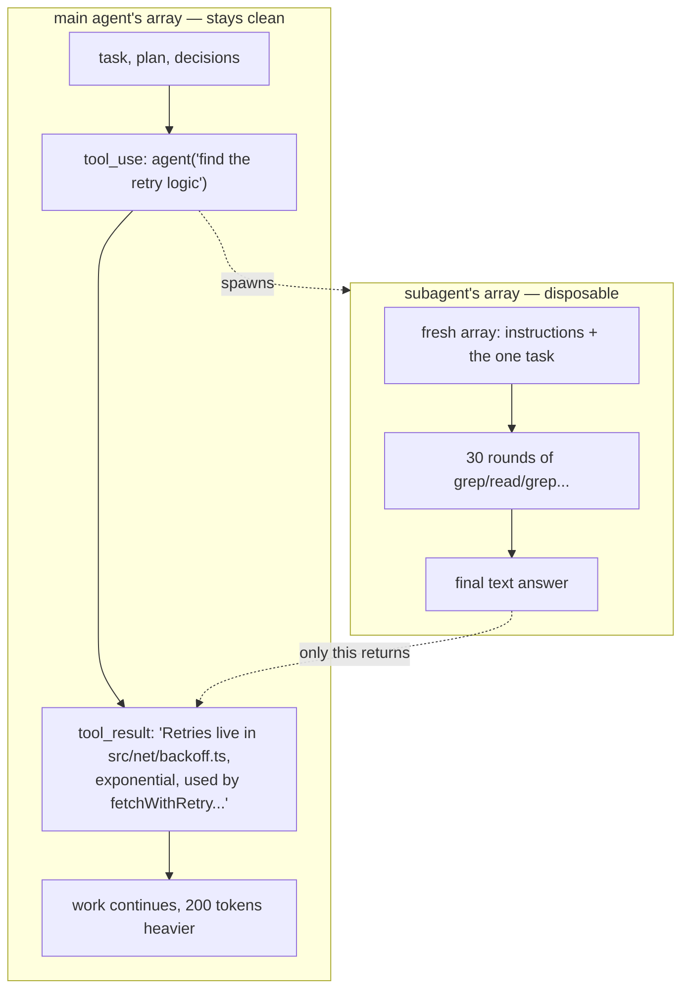

# Chapter 7: Subagents: Fork the Context

*Harness Engineering 101, Part II — Running Long.
[Series index](index.html) · [Prev](06-context-is-a-budget.md) ·
[Next: Steering](08-steering.md)*

---

**The failure:** some work is worth doing but not worth remembering. Ask an
agent "where is the retry logic implemented in this codebase?" and answering
honestly might take fifteen file reads and twenty searches: 50,000 tokens of
exploration. The *answer* is one sentence. If the main loop does this work
itself, those 50,000 tokens of dead ends sit in its array for the rest of
the session. They spend budget (chapter 6) and feed context rot, just to
carry one sentence of value.

**The patch:** do the messy work in a different array, and keep only the
conclusion. That is a **subagent**, and I want to define it precisely,
because the industry makes it sound like distributed systems:

> A subagent is a second agent loop, run with a **fresh, empty array**,
> given one task, whose final answer is returned to the main loop as a tool
> result. Then its array is thrown away.

That's it. Chapter 4's loop, called as a function.

## Subagents are a context tool, not an org chart

The framing you will often see treats them like people: a "team" of
specialist agents, a "researcher" talking to a "planner" talking to a
"coder." That framing hides the actual engineering reason subagents exist:

**Subagents exist to protect the main agent's context.**

The main loop's array is the project's working memory: the task, the plan,
the decisions so far. It is precious and finite. A subagent is a way to buy
50,000 tokens of exploration for the price of a 200-token summary in that
precious array. The child spends its own budget, in its own window, and dies.
The parent pays real money for the child's tokens (every subagent call is
ordinary API calls underneath) but keeps its *attention* clean. You are not
saving cost. You are saving working memory, which by chapter 6's argument is
the scarcer resource.



Three structural facts follow from the definition, and they answer most
practical questions about subagents:

**The child knows nothing.** Its array starts empty except for its
instructions and the task string the parent wrote. It has not seen the
conversation, the user, or the plan. So the parent's task description must
be self-contained: what to find, where to look, what shape of answer to
return. Vague delegation produces vague results. The model isn't weak. You
sent a colleague into a room with no briefing.

**The parent sees nothing but the report.** The child's thirty rounds of
searching never enter the parent's array. This is the entire point, but it
has a consequence: if the child's answer is wrong, the parent has no
transcript to check. Trust but verify: good harnesses let you inspect child
transcripts out-of-band (chapter 12), and good parents ask for evidence in
the report ("cite file paths and line numbers").

**Results return on the tool channel.** To the parent, `agent` is just
another tool: request out, result in. Everything from chapter 3 applies,
including error handling. A subagent that fails should fail loudly in its
tool result.

## What to delegate

The budget framing gives you the rule directly: delegate work whose
**intermediate volume is high and final value is small.**

Good delegation targets:

- **Search and exploration.** "Find where X happens." Huge intermediate
  reads, one-line answer. This is the canonical case, and it is why Claude
  Code ships a read-only Explore agent.
- **Verification.** "Run the test suite and summarize failures." Thousands
  of lines of output, a table of value.
- **Research.** "Read these three docs pages and tell me the migration
  steps." (Web pages are the worst context polluters of all.)
- **Parallel independent chunks.** Review five files for the same issue: five
  subagents, five clean summaries, and they can run concurrently, because
  each has its own array. Fan-out is free architecture once subagents exist.

Poor delegation targets:

- **Work needing the session's accumulated judgment.** The child lacks the
  parent's context by design. "Continue implementing the feature" delegates
  the one thing that cannot be summarized into a task string.
- **Tiny lookups.** Spawning a loop costs several API round trips. If one
  grep answers it, run one grep in the main loop.
- **Long chains of dependent edits.** Each handoff loses context. Depth is
  where multi-agent systems fail; real-world experience keeps landing on
  one coordinator with shallow, disposable workers, not deep hierarchies.

## The toy harness, v4

The beautiful thing about implementing subagents is discovering there is
almost nothing to implement. [`harness/v4_subagents.py`](https://github.com/IsuruMaduranga/harness-engineering-101/blob/main/src/harness/v4_subagents.py)
adds one tool whose executor calls the loop we already have:

```python
AGENT_TOOL = {
    "name": "agent",
    "description": ("Delegate a self-contained task to a subagent with its "
                    "own fresh context. It can read files and run commands, "
                    "and returns only its final answer. Use it for searches "
                    "and research whose details you don't need to keep. "
                    "The subagent knows NOTHING about this conversation, so "
                    "include all necessary background in the task."),
    "input_schema": {"type": "object",
                     "properties": {"task": {"type": "string"}},
                     "required": ["task"]},
}

def run_subagent(task):
    """A subagent IS the agent loop, run over a fresh array."""
    sub_messages = [{"role": "user", "content": task}]     # fresh world
    final_text = run_loop(sub_messages, tools=SUB_TOOLS,   # chapter 4's loop
                          system=SUB_SYSTEM, quiet=True)
    return final_text or "(subagent returned no answer)"   # only this survives
```

The parent's `execute_tool` gains one branch: `if name == "agent": return
run_subagent(args["task"])`. The child gets the read-and-run tools but *not*
the `agent` tool itself (no grandchildren; recursion is where toy budgets
die), and a system prompt telling it to end with a report. Maybe twenty new
lines in total, and the program now does fan-out context management.

Try it: give v4 a question that requires reading many files, and watch the
parent's array stay small while the child grinds. Then print
`len(json.dumps(messages))` for both arrays and see the trade directly.

## Production notes

What separates the toy from Claude Code's Agent tool is quality-of-life, not
concept, and each item is a preview of a later chapter:

- **Named agent types.** Production harnesses define profiles (an explorer
  that cannot write files, a planner, a reviewer): different system prompts
  and different *tool subsets* per type. The read-only explorer is a
  permission decision (chapter 13) as much as a role.
- **Different brains per role.** Routine search does not need the frontier
  model; a cheaper model does it fine. Model routing is Appendix A.
- **Background execution.** The parent should not block for minutes on a
  slow child. Making children asynchronous is chapter 9's machinery.
- **Messaging a running child.** Some harnesses let the parent send
  follow-ups to a child that stays resident, which begins to blur into
  chapter 9's background tasks.
- **A fork variant.** One special child type starts with a *copy* of the
  parent's array instead of an empty one: full context, disposable
  continuation. Useful when the task needs everything the parent knows;
  costs the entire context re-read that a fresh child avoids. Both exist
  because both trade-offs are real: fresh children protect budget,
  forked children preserve judgment.

One habit transfers directly from this chapter regardless of harness: when
you (a human) write a subagent task, or a tool description for the `agent`
tool, write it like a ticket for a contractor with no Slack access. What to
do, where to look, what done looks like, what to return. Every failure I
have seen in multi-agent systems that was blamed on "coordination" was a
bad ticket.

One Code's [subagents extension](https://github.com/IsuruMaduranga/one-code/tree/master/extensions/subagents)
is this chapter at production size: the same recursive loop, with a live
panel for the running children, a model you can pick per task, and a
worktree per child.

## What you now know

- A subagent is the agent loop run over a fresh, disposable array; only its
  final report enters the parent, as a tool result.
- The point is context protection: high-volume exploration for a
  fixed-size summary. Cost in tokens, savings in attention.
- The child knows nothing; the parent sees only the report. Write
  self-contained tasks, demand evidence in answers.
- Delegate high-volume/low-residue work; keep judgment-heavy work in the
  main loop. Fan out in parallel; avoid deep hierarchies.
- Implementation is one tool plus a recursive call to the loop you already
  have.

The main array is now protected from bulk. The next threat is subtler: over
a long session, the *brain* drifts off course, forgets standing rules, and
misses changes in the world. The harness needs a way to whisper to a running
loop without breaking chapter 5's caching rules.

*[Next: Chapter 8 — Steering the Running Loop](08-steering.md)*
