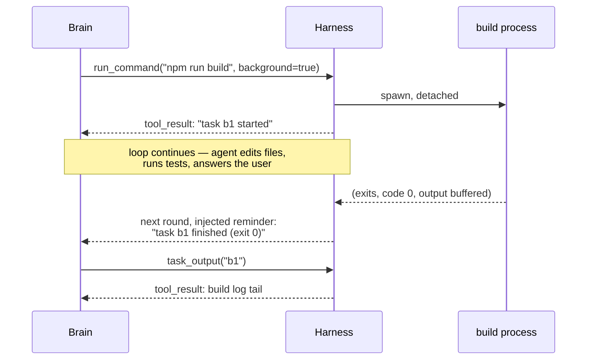

# Chapter 9: Background Work and Time

*Harness Engineering 101, Part II — Running Long.
[Series index](README.md) · [Prev](08-steering.md) ·
[Next: Frameworks Are Wrappers](10-frameworks-are-wrappers.md)*

---

**The failure:** everything we have built is synchronous. The model calls a
tool; the loop *waits*; the result comes back; the loop continues. Now let
the agent start a 20-minute build. The choices are all bad: block the whole
loop for 20 minutes (the agent can do nothing else, the user watches a
spinner), time the tool out (the model learns "builds fail here"), or worst
and most common, the model decides to *poll*: `sleep 30` then check, `sleep
30` then check, forty API round trips of a very expensive brain doing the
job of a kitchen timer.

And beyond the single slow command sits the bigger version: work that should
happen *when something happens* ("tell me when CI goes green") or *at a
time* ("check the deploy every hour"). Our loop has no concept of time at
all. It runs when a message arrives and is otherwise a stone.

**The patch** comes in two halves that mirror each other:

1. **Let work leave the turn**: a tool result may be "started, still
   running" instead of "finished, here's the output."
2. **Let events start a turn**: the harness can call the model because
   something happened, not only because the user typed.

Together they change the shape of the system. The brain stops being a
subroutine of the user's keyboard and becomes something the harness
schedules, like any other process.

## Half one: tasks that outlive the tool call

The mechanics are ordinary systems programming. The harness keeps a **task
registry**: a table of running background jobs, each with an ID, a status,
and a buffer collecting output. Three tool-visible pieces make it work:

- The `run_command` tool grows a `run_in_background` flag. With it set, the
  tool starts the process detached and returns *immediately* with a task ID:
  `"started task b1 (npm run build), still running"`.
- A `task_output` tool: given an ID, return output collected so far, plus
  status. The model peeks when it has a reason to.
- A `task_stop` tool: kill a job that is no longer wanted.

The subtle part is the last arrow before the peek: **completion arrives as a
steering event.** When the process exits, the harness does not interrupt
anything; it enqueues a chapter 8 reminder ("task b1 finished, exit 0"),
which rides into the next round's user-side message. If no round is running
because the turn already ended, the harness *starts* one: it appends the
notification to the array and calls the model. That is the first appearance
of half two: something other than the user causing an API call.

Notice how the pieces we already built made this cheap. The registry is a
dict; the notification channel is the reminder queue; the "wake the brain"
move is just `messages.append(...)` plus `call_llm(...)`, which is all a
turn ever was.

One steering detail from production that looks trivial and is not: the
harness should *block* the model from foreground `sleep`. Claude Code and
One Code both do this: a guard rejects `sleep`-style waiting with a message
telling the model to use background tasks and notifications instead. Models
poll because polling is what their training data does; the harness has to
make the good pattern the easy one. Tool design is behavior design.

## Half two: the brain gets an alarm clock

Once "the harness can start a turn" exists for task completion, generalize
it. Three forms, each a step up from the last, each just a different
*trigger* attached to the same wake-the-brain move:

**Monitors: wake on condition.** "Watch this log file for ERROR lines,"
"tell me when the CI run finishes." The harness watches cheaply
(filesystem events, a polling thread, a webhook); when the condition
trips, it injects a description of what happened and invokes the model.
The expensive brain sleeps; the cheap body watches. This flips the polling
problem around exactly: polling is the brain doing the body's waiting;
monitors are the body doing it.

**Schedules: wake at a time.** Cron for agents. "Every morning, summarize
new issues"; "in an hour, check the deploy." Implementation is a timestamp
in a table and a timer loop. The interesting design question is what the
woken brain sees: a fresh array with a task prompt (a scheduled *job*), or
the continuation of an existing session (a *follow-up*). Both are useful;
the harness has to be explicit about which it is doing, because chapter 1
taught us those are entirely different conversations.

**Self-scheduling: the model sets its own alarm.** Give the model a
`schedule_wakeup` tool: "nothing to do until the deploy finishes, wake me
in 10 minutes." The model, mid-task, *chooses* to end the turn and name the
condition for resuming. This is the agentic version of an await: the model
yields, the harness resumes it. Claude Code's self-paced loop mode works
this way: each wakeup, the model does an increment of work and schedules the
next one, with the interval as its own judgment call ("CI takes ~8 minutes,
so check once in 8 minutes, not sixteen times in 30 seconds").

The progression is worth seeing plainly: chapter 4's loop ran while *the
model* had things to do; chapter 9's system runs while *anything* has
things to do. User input becomes just one event source among several: task
completions, file changes, timers, webhooks. The agent has become a
resident of the machine rather than a function call from a chat box.

## The rules that keep this safe and sane

Long-running and self-waking agents amplify every earlier chapter's
concern, so the discipline matters more here:

- **Every wake costs money.** An idle "check again every 60 seconds" loop
  is a space heater made of API calls. Match wake frequency to how fast the
  watched thing actually changes; prefer condition triggers over short
  timers; make no-change wakes cheap (a short array, or a cheap model,
  Appendix A).
- **Notifications, like all steering, must be true and traceable to their
  source.** The model will act on "task b1 finished." If the registry lies
  (a crashed watcher, a dropped exit code), the model builds on a false
  world. Fail loud in the registry.
- **The user must be able to see and kill everything.** A background
  registry without a management surface ("what is running on my machine
  right now, stop it") is how agents earn distrust. This is a chapter 13
  concern arriving early: autonomy is granted, and the grant must be
  visible, and you must be able to take it back.
- **Sessions are files, again.** A scheduled wake ten hours later lands in
  a process that may have restarted. Background work forces you to make the
  chapter 1 point literal: the array, the task registry, and the pending
  alarms all have to live on disk, or the agent's commitments die with the
  process.

## The toy harness note

I did not write a v5; the interesting parts are threads and bookkeeping
rather than new concepts, and the code would double in size for one
chapter. If you want the exercise, it is a good one: add a `tasks` dict, a
`run_in_background` flag that wraps `subprocess.Popen` and a reader thread,
a `task_output` tool, and a check at the top of each user turn that drains
finished-task notices into the next message. Every piece is standard
Python. The epilogue's full harness includes a minimal version.

## What you now know

- Slow work becomes a background task: start detached, return an ID,
  collect output in a registry. `task_output` to peek, `task_stop` to kill.
- Completions and conditions come back as steering events (chapter 8's
  queue), and if no turn is running, the harness starts one: the body can
  now invoke the brain.
- Monitors, schedules, and model-set wakeups are one mechanism with three
  triggers. The brain sleeps; the body watches; polling dies.
- Discipline: price the wakes, never lie in notifications, keep everything
  visible and killable, persist all of it.

This completes Part II: the array under pressure, from budget to forks to
whispering to alarm clocks. Part III steps back to the ecosystem. First
stop: those frameworks you have been told you need, and what is actually
inside them, which you are now fully equipped to see.

*[Next: Chapter 10 — Every Framework Is a Wrapper Around Chapter 1](10-frameworks-are-wrappers.md)*
