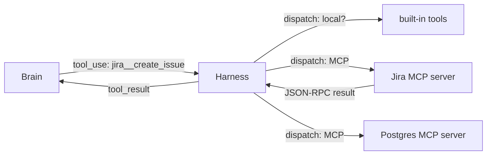

# Chapter 11: Extending the Body: MCP, Skills, Deferred Loading, Hooks

*Harness Engineering 101, Part III — The Ecosystem.
[Series index](index.html) · [Prev](10-frameworks-are-wrappers.md) ·
[Next: Debugging the Array](12-debugging-the-array.md)*

---

**The failure:** our harness's capabilities are hardcoded. Every tool is a
function in our source; every behavior is a line we wrote. Real users
immediately want more: connect the agent to Jira, teach it our deployment
procedure, make it run our linter after every edit. If each of those means
editing harness code, the harness author becomes the bottleneck for every
capability on earth.

And there is a second failure hiding behind the first: suppose you *could*
plug in everything. A hundred connected tools means a hundred schemas in
every request. Chapter 6 did that math: the tool list alone would eat the
context budget before work begins. More capability makes the array worse.

So the real question this chapter answers is: **how do capabilities get
into the body, and into the array, without the harness author writing them
and without drowning the budget?** The ecosystem's four answers, in the
order I would teach them: MCP (someone else's tools), skills (someone
else's instructions), deferred loading (tools that stay out of the array
until needed), and hooks (someone else's reflexes).

## MCP: tools from other processes

**Model Context Protocol** (MCP, Anthropic 2024, now adopted across the
industry) standardizes one thing: how a harness discovers and calls tools
that live in *another program*.

An MCP **server** is a small external process (or remote service) that
speaks a JSON-RPC protocol. The harness, as MCP **client**, launches or
connects to it and asks `tools/list`. The server replies with tool
definitions: name, description, JSON schema. Sound familiar? It is exactly
chapter 3's tool format. The harness merges these into the tool list it
sends the model, prefixed to avoid collisions (`jira__create_issue`). When
the model calls one, the harness forwards the call to the server
(`tools/call`) instead of its own dispatch table, and relays the result
back as an ordinary `tool_result`.

That is the entire trick: **the dispatch table from chapter 3 got a network
hop.** The model cannot tell a built-in tool from an MCP tool; both are
schemas in, results out. What MCP actually bought the ecosystem is the
economics: the Jira integration is written once, by anyone, and works in
every MCP-speaking harness. Tools became an ecosystem instead of a feature
list.

Two working notes. First, MCP servers also offer *resources* (readable
data, like files) and *prompts* (reusable templates); tools carry most of
the real traffic. Second, an MCP server is code you are wiring into your
agent's body, with all the trust questions of any dependency, plus new
ones: its tool descriptions go into your array (a channel for injected
instructions) and its results come back as "world truth." Chapter 13 takes
that seriously; here, just note that plugging in limbs from strangers is a
security decision.

## Skills: instructions on demand

MCP delivers *capabilities*. But much of what makes an agent useful in a
particular team is not a new tool, it is *knowledge of procedure*: how we
write commit messages, how to run the release, how this odd test harness
works. That is prose, not code.

The naive place for prose is the system prompt or the memory file (chapter
6), and for small stable facts, that is right. But procedures are long, and
most are irrelevant to most sessions. Pasting your 3,000-token release
runbook into every array, on the chance the user says "cut a release," is a
serious waste of budget.

A **skill** is the budget-respecting version: a folder with a markdown file
of instructions (plus optional scripts and templates), with a **name and a
one-line description**. At session start, the harness injects *only the
names and descriptions*: a menu, a few hundred tokens for dozens of skills.
When the task matches one, the model asks for it (via a `skill` tool call,
or the user types `/release`), and only *then* does the full body of
instructions enter the array, where the model follows it.

The mechanism deserves a name because you will use it constantly:
**progressive disclosure**. Keep the index in context, pull the detail on
demand. It's chapter 6's "pull beats push," applied to instructions. Memory-file
indexes point at deeper docs the same way. The next section shows the same
trick again, for tool schemas. A skill can even bundle
executable scripts, which the model runs with its ordinary shell tool; the
skill teaches *when and how*, existing tools do the work. Instructions
compose with capabilities.

Skills are also the cheapest extension point for *users*, which is why the
convention (a `skills/` folder in a project or home directory, discovered
by the harness) has spread fast: writing one is writing a markdown file.
Automation without programming.

## Deferred loading: the tool list on a diet

Now the hundred-tools problem directly. The insight is that a tool's
*schema* only needs to be in the array when the model is about to use it.
The rest of the time, it can be represented by something much smaller: a
name, or nothing at all.

**Deferred tool loading** (Anthropic's Tool Search, and equivalents) works
like the skills menu, one level down. The array carries a compact list of
deferred tool *names* plus one real tool: `tool_search`. When the model
needs, say, spreadsheet capabilities, it searches; the harness returns the
matching schemas and, on providers that support it, activates them for
subsequent requests. A hundred connected tools ride as a hundred short
lines plus one searcher, instead of a hundred full JSON schemas.

There's a wrinkle worth knowing, even if you never implement it. Once a
tool's schema is *activated* into the conversation, it has to stay available
and stable for the rest of the session (the model might call it twenty
rounds later, and chapter 5 punishes churn in the request). Deferred
loading is an append-only reveal, not a swap. One-way doors again; the
array's physics show up in every feature.

Step back and see the pattern across all three mechanisms so far. MCP,
skills, and deferred loading are the same idea at three altitudes: **an
index in the array, a body of detail outside it, and a fetch once you know
you need it.** Tools, instructions, schemas. If you remember
one thing from this chapter, remember the shape.

## Hooks: deterministic reflexes

The fourth mechanism is different in kind, and the difference is the
point. MCP, skills, and deferral all extend what the *brain* can choose to
do. A **hook** extends what the body does *regardless of what the brain
chooses*.

A hook is a user-supplied script bound to a lifecycle event of the loop.
The harness defines the events; Claude Code's set is a good reference:
before a tool call, after a tool call, when the user submits a prompt, when
the turn ends, when the session starts, and so on. At each event, the
harness runs the script and hands it a JSON description of what's happening
on stdin. Its exit code and output can do one of three things: *observe*
(log it), *augment* (add a message, injected as chapter 8 steering), or
*veto* (block the tool call and tell the model why).

Why does this matter when the model could be *asked* to do the same things?
Chapter 2's lesson, from the other side: the model is probabilistic.
"Always run the formatter after editing" as a system-prompt instruction
happens 97% of the time; as an after-edit hook, it happens 100% of the
time, because it is not a request to a brain, it is code on an event.
Hooks are how users install *guarantees*: policy ("block any tool call
touching `.env`"), hygiene (auto-format, auto-lint), integration (notify a
dashboard). The harness's own guardrails in chapter 13 are the same
species, built in rather than user-supplied.

The practical rule for choosing a mechanism, then, spanning this whole
chapter:

| You want to add... | Use |
|---|---|
| a capability (talk to a system) | an MCP server (or a built-in tool) |
| a procedure (knowledge of how) | a skill |
| scale (many capabilities, small array) | deferred loading |
| a guarantee (always / never, enforced) | a hook |

## What you now know

- MCP is chapter 3's dispatch table with a network hop and a discovery
  handshake: tools as an ecosystem. Treat servers as trusted limbs, because
  that is what they are.
- Skills are instructions behind a menu: index in context, prose on demand,
  executable extras via existing tools.
- Deferred loading does the same for tool schemas, with an append-only
  reveal to respect caching.
- All three are one shape: progressive disclosure against the context
  budget.
- Hooks are the other species: deterministic scripts on loop events, for
  behavior that must happen with probability 1. Brains choose; bodies
  guarantee.

The body is now extensible by strangers: their tools, their instructions,
their reflexes. Which sharpens a question that has been building since
chapter 5: with all these moving parts assembling every request, do you
actually know what your model is seeing? Next chapter: how to look.

*[Next: Chapter 12 — Debugging the Array](12-debugging-the-array.md)*
