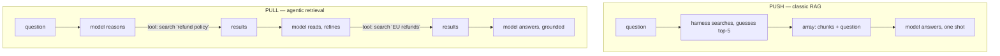

# Chapter 15: RAG Was a Harness Pattern All Along

*Harness Engineering 101, Part IV — Trust, Domains, and Data.
[Series index](README.md) · [Prev](14-coding-agents.md) ·
[Next: Epilogue — Build Your Own](16-epilogue-build-your-own.md)*

---

**The failure, one last time:** the model doesn't know your stuff. Chapter
2 explained why: its knowledge is a compression of public training text,
frozen at a cutoff. Your company wiki, your codebase, yesterday's support
tickets: not in the weights, and (chapter 6) too big to paste into the
array whole.

Around 2023 the standard answer to this got a name, an ecosystem, and a
scary-looking body of research: **RAG**, Retrieval-Augmented Generation.
Vector databases, embeddings, chunking strategies, and then the long list of
types: naive RAG, advanced RAG, hybrid RAG, graph RAG, corrective RAG,
self-RAG, re-ranking pipelines. Entire conference tracks. If you came into this
series with anxiety about that list, this chapter is the payoff, because
you now have the one sentence that organizes all of it:

> **RAG is deciding what goes in the array. That's it. Every variant is a
> different answer to "which text, chosen how."**

## Classic RAG, in harness terms

The original pattern, stated in this series' vocabulary: **the harness
retrieves before the model speaks.** The user asks a question; the harness
(not the model) searches a document store for relevant chunks; the winners
get pasted into the array next to the question; the model answers, now
"grounded" in text it was handed.

```python
def rag_answer(question):
    chunks = search(question, top_k=5)          # the harness decides
    context = "\n\n".join(c.text for c in chunks)
    messages = [{"role": "user", "content":
        f"Answer using this context:\n{context}\n\nQuestion: {question}"}]
    return call_llm(messages)
```

Note what this is: chapter 6's memory-file injection, with a search step
choosing what to inject. There is no loop, no tools, no agent. RAG predates
all of them; it was invented for the GPT-3.5-era chatbot, where the model
got exactly one shot at the array, so the harness had to guess, up front,
everything the model might need. Call this the **push** model: the body
guesses, and stuffs.

The famous machinery all lives inside that `search()` call. **Embeddings**:
turn text into vectors such that similar meanings land near each other, so
"how do I get my money back" finds the refunds policy despite sharing no
words. **Chunking**: split documents into retrievable pieces. **Vector
database**: store the vectors, find nearest neighbors fast. All real
engineering, and all of it is *search-index engineering*: none of it
touches the model or the loop. Embedding search is one search method among
several, better than keyword search at synonyms and fuzz, worse at exact
identifiers and rare tokens (which is why production search is usually
**hybrid**: run both, merge). If you remember that an embedding index is
"grep for meaning," you know enough to build with it.

## The zoo, decoded

Now the list of types. Each celebrated variant answers "which text, chosen
how" with one extra trick, and in this series' terms they decode instantly:

| The name | What it actually is |
|---|---|
| Naive RAG | one vector search, top-k pasted in |
| Hybrid RAG | two search methods (keyword + vector), merged |
| Re-ranking | a second, better model re-sorts the candidates before pasting |
| Graph RAG | the index is entity links, not just chunks: search can follow relationships |
| Corrective / self-RAG | check the retrieved text (often with a model call) and re-search if weak |
| Agentic RAG | give the model the search as a *tool* and let it drive |

Read the right-hand column again: index choices, ranking choices, and
retry logic. Legitimate search engineering, none of it conceptually new,
and *nothing* in the left column deserves the anxiety of a proper noun.
You do not need to memorize a thousand RAG types. You need to know that a
search index has quality knobs, and that someone will keep naming the
knobs.

The last row, though, is the one that changed the game, because it moves
the decision.

## Push vs pull: the real dividing line

This series built an agent that reads files *on demand*: the model
notices it needs `backoff.ts`, calls a tool, and the result lands in the
array. Apply that to documents and you have **agentic retrieval**: expose
`search_docs` as a chapter 3 tool, and let the *model* decide what to look
up, read the results, and search again with a refined query if the first
pass missed.



Push versus pull is the real dividing line in this whole subject, and the
trade is exactly the one you already know from chapter 6 ("don't inject
what the model can fetch"):

**Pull wins on quality**, for the same reason a librarian beats a
conveyor belt. The push harness must guess relevance from the question
alone, in one shot, before any reasoning happens; wrong guess, wrong
grounding, and the model answers confidently from the wrong pages. The
pull model formulates its *own* queries mid-reasoning, sees the results,
notices they are off, and searches again: retrieval with a feedback loop
in it. Multi-hop questions ("compare our refund policy with the one we
had before the rebrand") are nearly impossible to pre-fetch and natural
to pull.

**Push wins on cost and latency.** One search, one model call, done. A
pull loop is several rounds of an expensive brain. For a
high-volume support chatbot answering single-hop questions over a clean
document set, classic push RAG remains the correct engineering answer, and
"agentic" would be waste. Push is also the only option when there is no
loop at all: batch pipelines, one-shot API products, strict latency
budgets.

So the design rule: **pull when reasoning should steer the reading; push
when the reading is predictable.** And they compose: a fine pattern is a
cheap push (paste an obviously relevant page) plus pull tools for
everything else. A coding agent already works this way: the memory file is
push; grep is pull.

One more connection, promised in chapter 7: when the pulling gets long, do
it in a subagent. Deep research over a big document set is high in
volume and leaves little behind: fork it, let the child burn its own array
searching and reading, keep the cited summary. "Deep research" products
are approximately this pattern, productized.

## What this chapter is really about

I picked RAG for the finale not because you will build one tomorrow but
because it is the cleanest demonstration of what this series has tried to
install in you. From outside, RAG looks like a subfield: its own acronym,
its own vendor landscape, its own list of types to memorize. From inside the
harness view, it is fifteen chapters of familiar parts: the stateless
array (ch. 1) that must be filled; a budget (ch. 6) that forces selection;
push injection (ch. 6 memory, ch. 8 steering) or pull tools (ch. 3) in a
loop (ch. 4), maybe forked (ch. 7); plus a search index with quality knobs,
which is the only genuinely new component and is not an AI component at
all.

That collapse is not special to RAG. It is what most of the field's proper
nouns look like from in here: frameworks (ch. 10), MCP and skills (ch.
11), multi-agent systems (ch. 7), agentic this and autonomous that. The
next acronym will arrive on schedule. When it does, ask the questions this
series trained: *what ends up in the array? who decides, brain or body?
what does it cost, and what enforces it?* The answers locate anything.

## What you now know

- RAG = choosing what goes in the array, with a search index doing the
  choosing. Embeddings are grep-for-meaning; the rest of the machinery is
  search engineering.
- The variant zoo is knob-naming: index tricks, rankers, retries. Learn the
  knobs, ignore the classification.
- The real axis is push (harness guesses up front; cheap, one-shot,
  guessable document sets) versus pull (model steers retrieval mid-reasoning;
  better on hard questions, costs a loop). Compose them; fork the long
  pulls.
- The bigger lesson: the harness view turns the field's proper nouns into
  simple questions about the array. That skill, not any single pattern, was
  the point of 101.

What remains is to put the whole body on the table: the epilogue walks the
complete toy harness, all fifteen chapters in ~300 lines you can run,
break, and rebuild.

*[Next: Epilogue — Build Your Own](16-epilogue-build-your-own.md)*
